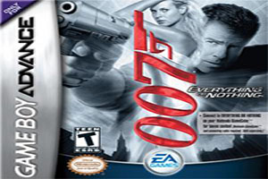

# Image Contribution Guidelines

To maintain a clean, professional, and consistent look for **Jet Yehs Unblocked Games**, all contributors must follow these strict requirements for game cover art.

## Technical Specifications
* **Dimensions:** Exactly `300 x 200` pixels.
* **File Format:** `.jpg` (JPEG) only.
* **Aspect Ratio:** 3:2.

## Content Requirements

### 1. No Text on Art
The game title is already displayed in the website UI directly beneath the image. To avoid redundancy and visual clutter, **cover art images MUST NOT contain any text.** 

 - **Exception: Retro Cartridge Art** > This exception is granted for games originally released on handheld consoles (e.g., **GameBoy Advance**). For these titles, using the **original cartridge label art** is encouraged to maintain authenticity. In these cases, the game title appearing on the sticker is acceptable. Art for these games can be found at https://gamefaqs.gamespot.com/

### 2. Accurate Representation
The artwork must directly represent the actual gameplay or the main theme of the game. Avoid using "clickbait" images or unrelated generic art.

### 3. Visual Focus
Choose images that are clean and easy to recognize even at a small size. Since the eye should be drawn to the art rather than reading text, high-contrast and vibrant screenshots usually work best.

* **Bad Example:** An image with the game logo or "Play Now" text across the middle.

* **Good Example:** A high-quality screenshot or concept art that captures the vibe of the game without words.

* **GBA Exception:** The GBA cover art from the cartridge, this exception is included becuase the best way to display these games is the original art.

## AI Policy

* **Allowed:** Using AI tools (like upscalers or "generative fill") to resize, sharpen, or remove text from an existing game screenshot or game art.

* **Not Allowed:** Using AI to generate a brand new image from scratch.

---

## How to Add Assets
1. Ensure your file is named clearly (e.g., `minecraft.jpg` or `temple-run.jpg`). Capital letters are not allowed use `-` in place of a space.
2. Verify the dimensions are exactly `300 x 200`.
3. Place the file in the `/img/cover-art/` directory.
4. Update the `/js/games.js` file to point to the new asset.
